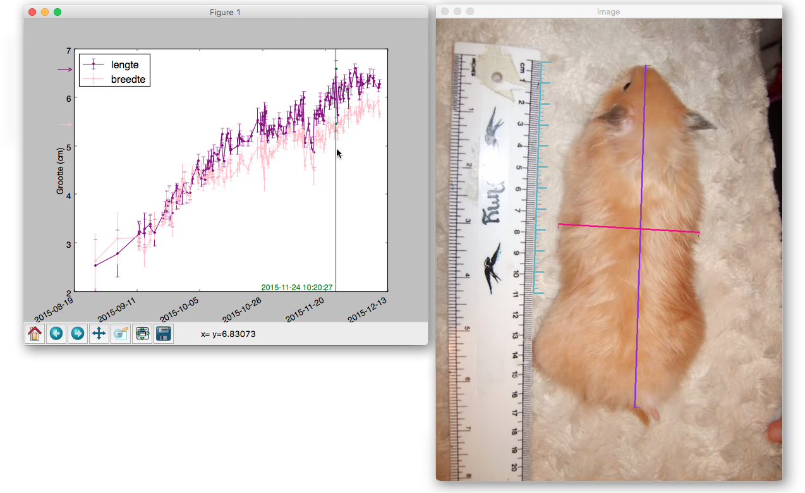

# MedPlot

This is a small project, that keeps track of an objects size over time using a manual annotation tool. Each photo should contain (at least one) reference. The photos are ordered chronologically, and using the keys, the user can browse trough them. The references and the actual measurements are inserted using the mouse, and updated live in the plot window.

The date-information is substracted automatically from the EXIF tags in the photos.
The plot window is interactive, clicking on the graph will browse to the photo at that specific time.

## Dependencies
- OpenCV2
- Pandas
- PIL
- Matplotlib, np